# 【夯爆了！多智能体大模型毕业设计】LangGraph+多Agent协作编排的高考志愿填报推荐系统(爬虫+大屏可视化+志愿填报助手+智能推荐)-计算机毕业设计
# 基于Python+LangGraph多Agent协作的高考志愿填报推荐系统 

## 项目概述

本项目名为“知途”，是面向高考考生的志愿规划与历史数据参考系统，适用于本地演示和科研教学。系统采用 Vue 3 + TypeScript + Flask 前后端分离架构，以 MySQL 8 保存业务数据，围绕“建立考生档案—查询院校与录取数据—生成参考推荐—咨询 AI 助手—整理志愿方案”形成完整使用流程。

对话功能通过 LangGraph `StateGraph` 编排 Router / Knowledge / Tool / Recommender / Summary 五个 Agent 节点，将意图识别、知识检索、院校查询、规则推荐和回答整合串联起来。AI 根据已检索的资料回答，信息不足时简短追问，并以流式文字、院校卡片和检索依据呈现结果。

系统的院校与录取分数线以 `school_info`、`school_score_line` 两张源表为唯一事实来源，应用只读访问，后续数据更新仍由爬虫或数据维护流程完成。一分一段数据通过独立接口同步并缓存；账号、考生档案、推荐报告、会话及志愿方案等保存于新增业务表。院校数量、数据年份和覆盖范围以当前数据库查询结果为准。

界面采用雾白、靛蓝和青绿的配色，以桌面使用为主，对登录表单、导航、页面标题和内容间距进行紧凑化设计。常用表单尽量一屏完成，长列表和对话内容保留正常滚动。当前版本不包含院校对比、图片识别、投诉工单、支付及官方志愿提交功能。

### 核心创新点

1. **多 Agent 协作编排**：使用真实的 LangGraph 状态图共享任务状态，Router 按咨询意图调度 Knowledge、Tool 或 Recommender，再交由 Summary 整合结果；按任务选择相关节点，并非每轮都执行全部五个节点。
2. **真实数据与推荐规则联动**：院校、历史分数线和已发布知识库通过受控服务检索。AI 助手与独立推荐页面共用规则服务，避免两处推荐口径不一致；大模型不直接修改源数据或任意执行 SQL。
3. **可解释的历史参考推荐**：固定以目标填报年份的上一年作为参考年，例如目标为 2026 年时使用 2025 年数据。报告保留考生条件、来源记录、依据快照及规则版本，便于回看和说明结果。
4. **流式回答与院校卡片**：通过 SSE 展示 Agent 执行阶段、增量回答和数据卡片。推荐卡片上方显示本次分数、位次、科类、批次等条件，卡片内展示院校信息、历史数据和推荐理由。
5. **持续对话与个人规划**：支持多会话、历史消息及上下文衔接；收藏、志愿方案排序、备注和 CSV 导出帮助用户将候选院校整理为个人草案。
6. **分层权限与管理可视化**：普通用户与管理员采用 JWT 和服务端会话校验隔离权限，后台提供用户管理、院校扩展资料、知识库维护、业务统计及审计记录。

## 要求
### 源码有偿！一套(论文 PPT 源码+sql脚本+教程)

### 
### 加好友前帮忙start一下，并备注github有偿高考27
### 我的QQ号是2827724252或者微信:code520888 或者 bysj2023nb

# 

### 加qq好友说明（被部分 网友整得心力交瘁）：
    1.加好友务必按照格式备注
    2.避免浪费各自的时间！
    3.当“客服”不容易，repo 主是体面人，不爆粗，性格好，文明人。

## 运行演示视频

https://www.bilibili.com/video/BV1Lqhm6GEjf

## 运行截图

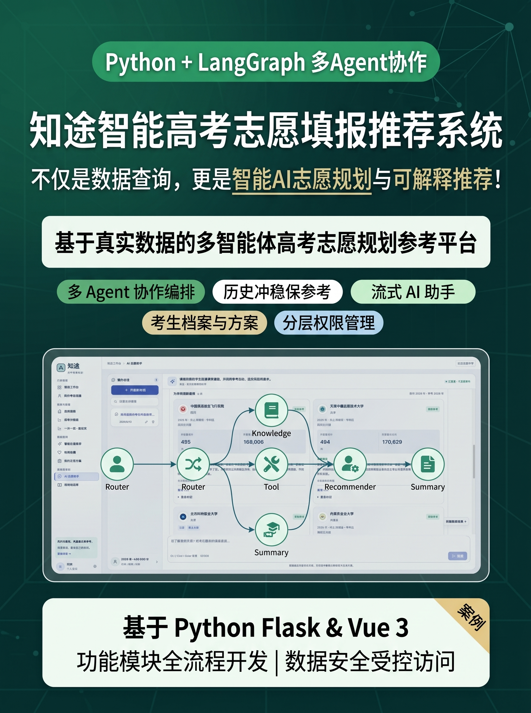
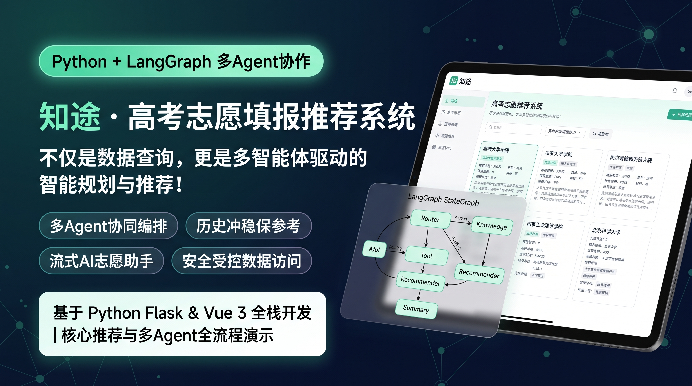
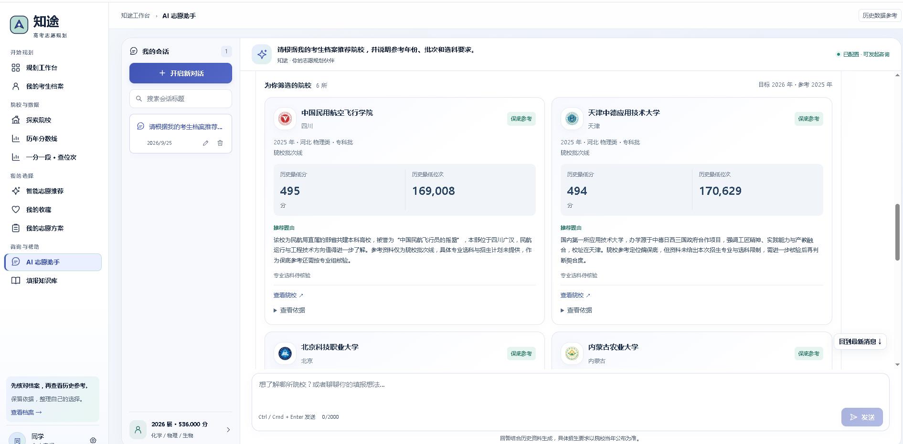
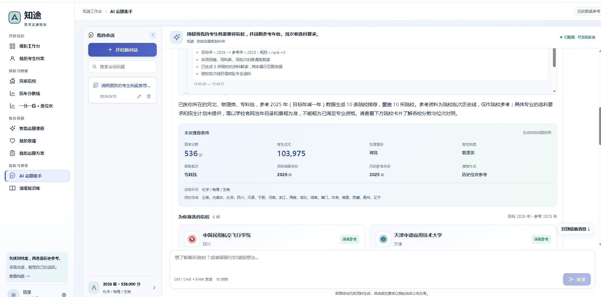
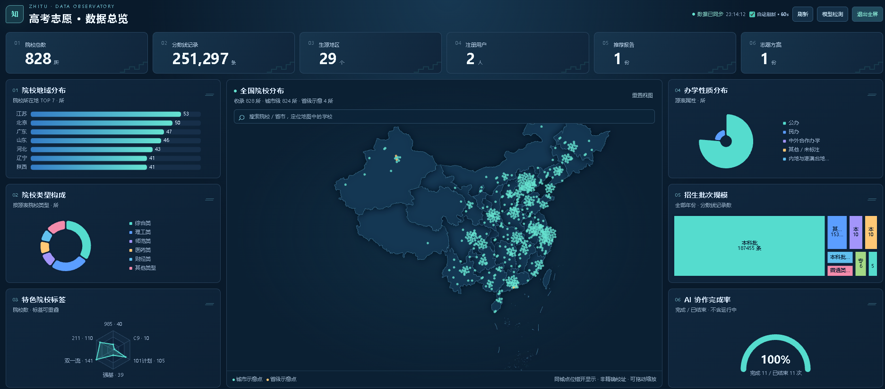
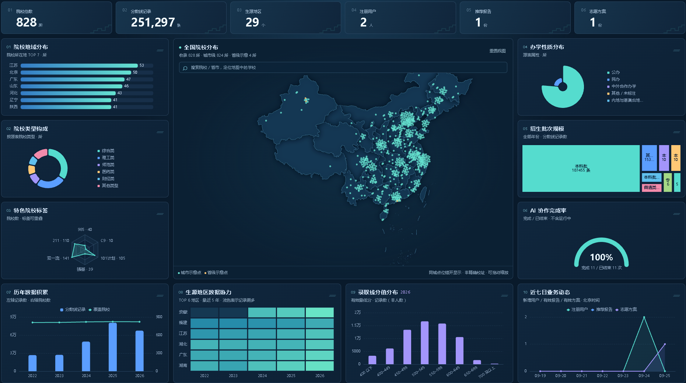
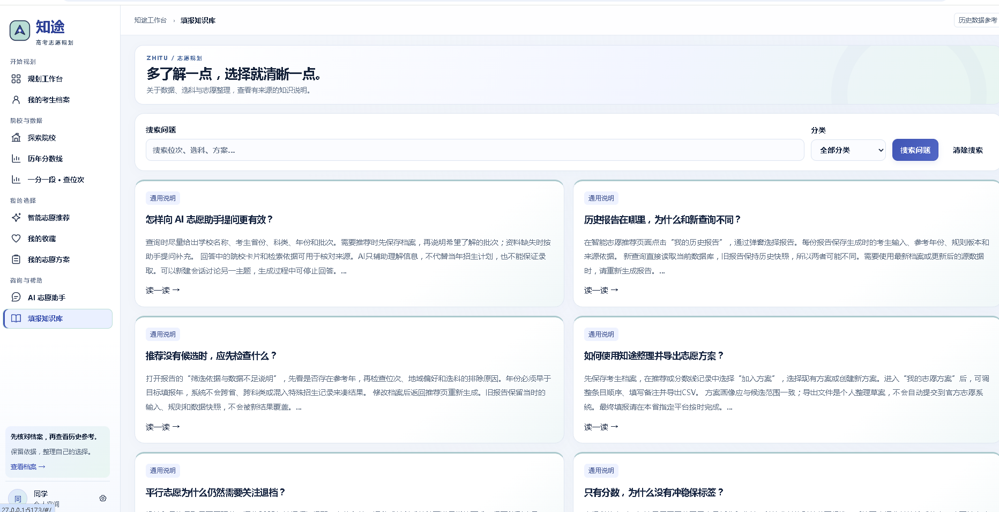
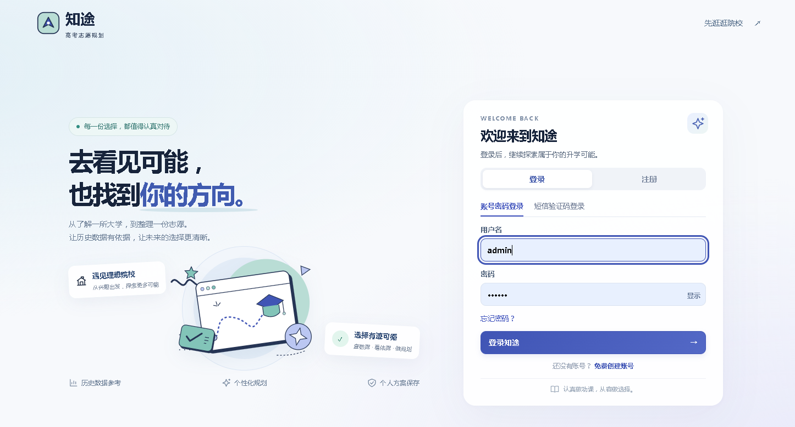
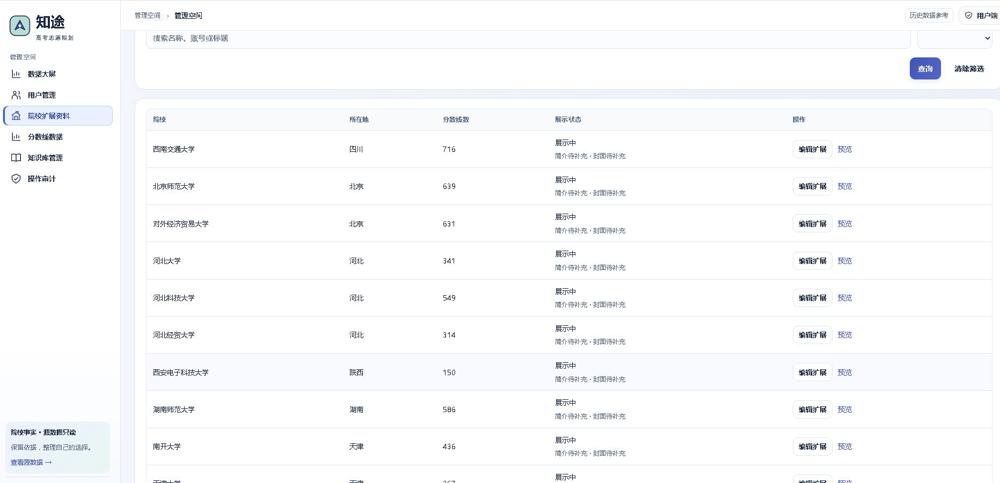
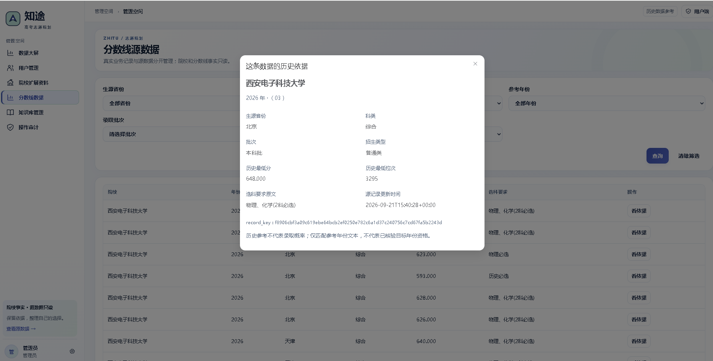
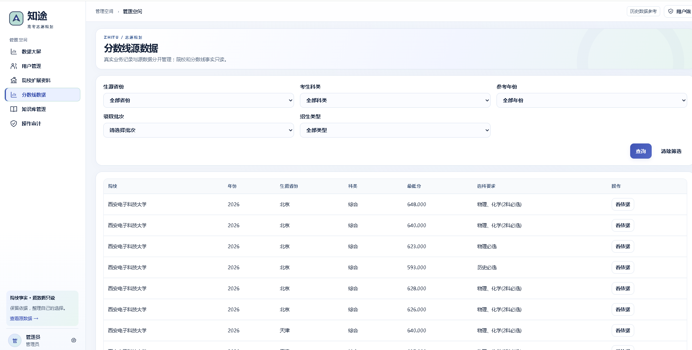
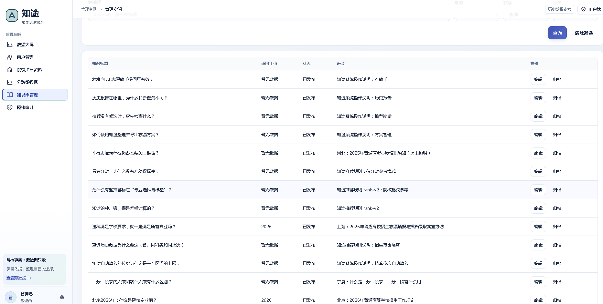
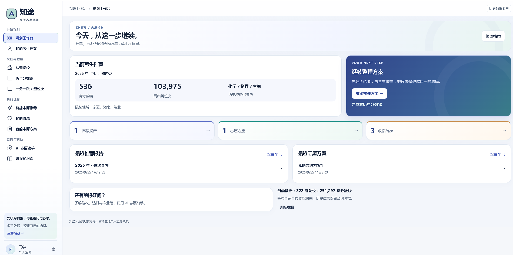
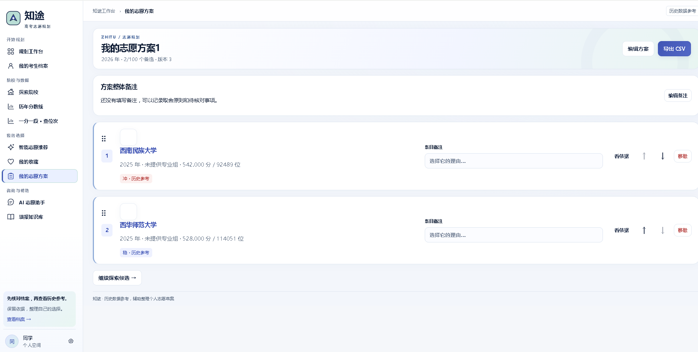
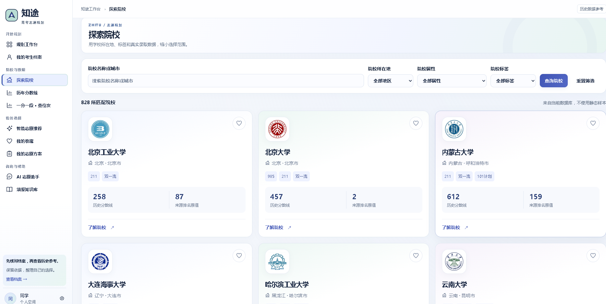
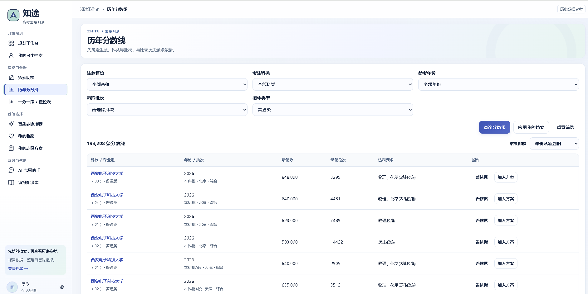
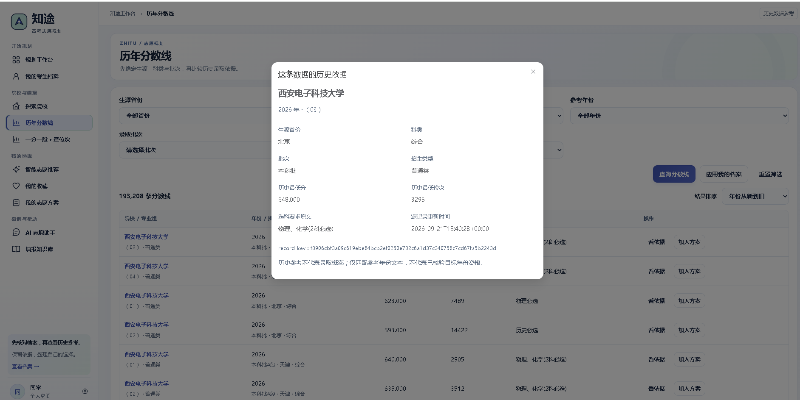
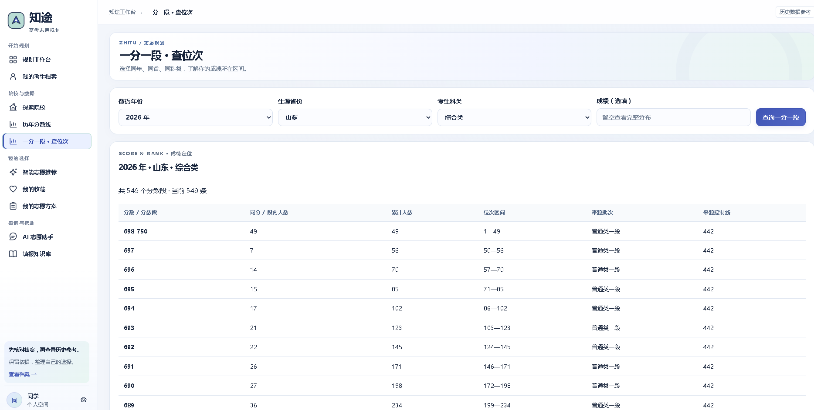
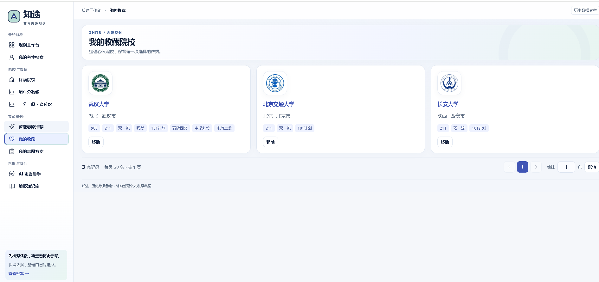
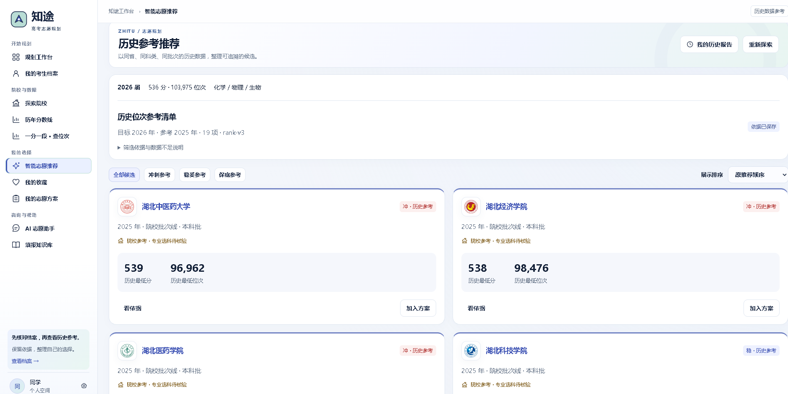


## 技术架构

### 整体架构设计

系统分为前端展示、后端业务、Agent 协作、数据库与运行文件存储几个部分：

```text
浏览器：Vue 3 用户端 / 管理端
  │ 开发模式：Vite 5173；构建后：Flask 5020 同源提供页面
  ▼
Flask 后端（5020，/api/v1）
  ├─ JWT 鉴权、账号资料、短信登录与密码重置
  ├─ 考生档案、院校查询、规则推荐、收藏与志愿方案
  ├─ LangGraph StateGraph
  │    Router → 按需调度 Knowledge / Tool / Recommender → Summary
  │      ├─ 受控知识检索、院校查询及推荐服务
  │      └─ HTTPX → 外部大模型兼容接口 → SSE 流式返回
  ├─ MySQL 8
  │    ├─ 源表：school_info、school_score_line（应用只读）
  │    └─ app_ 业务表：账号、手机号、档案、一分一段快照、
  │                     推荐报告、方案、会话、知识库、文件与审计等
  └─ runtime/
       logs / uploads / exports / cache / tmp / artifacts
```

正式工程代码位于 `项目代码/backend` 和 `项目代码/frontend`，原有 `项目代码/spider` 保留独立。`runtime` 集中存放日志、上传文件、导出文件、缓存、临时文件、前端构建产物和测试报告。

源库和业务库通过独立连接配置访问，可部署在同一 MySQL 实例或不同数据库中。`backend/sql/init.sql` 用于初始化新增业务表，已有库的增量变更使用迁移脚本；`gaokao.sql` 含源表删建语句，仅用于首次准备数据，不作为日常启动或更新脚本。

### 技术栈详解

#### 前端技术栈

- **核心框架**：Vue 3 + Composition API + TypeScript。
- **UI 组件库**：Element Plus，结合自定义卡片、表单和桌面布局样式。
- **状态管理**：Pinia，管理登录状态及考生档案。
- **路由管理**：Vue Router，区分独立登录页、用户业务页和管理页。
- **HTTP 客户端**：Axios 处理常规接口，`fetch` 接收 SSE 流式响应。
- **图表可视化**：ECharts 用于院校历史数据等图表展示，管理概览结合指标卡和趋势展示。
- **Markdown**：markdown-it 渲染回答与知识内容，DOMPurify 清理不安全的 HTML。
- **构建工具**：Vite；构建产物集中输出到 `runtime/artifacts/frontend-dist`。

#### 后端技术栈

- **核心框架**：Python 3.13、Flask 3.1 系列。
- **数据库**：MySQL 8，通过 SQLAlchemy + PyMySQL 访问；源数据和业务模型分离。
- **身份认证**：Flask-JWT-Extended，结合服务端会话、账号状态和令牌版本检查。
- **Agent 编排**：LangGraph `StateGraph` 实际组织五个 Agent 节点，通过共享状态与条件路由完成协作。
- **大模型**：通过 HTTPX 调用兼容 OpenAI Chat Completions 协议的外部模型服务，连接参数集中在后端 `.env`。
- **短信服务**：参考 `短信/SendSms.java` 的云市场 APPCODE 表单接口，服务端发送并核验验证码；密钥不进入前端。
- **输入与文件处理**：Pydantic 校验业务输入，密码以哈希保存，日志及文件归入 `runtime`。

## 核心功能模块

### 1. 用户管理系统

#### 功能特性

- **账号登录与注册**：提供独立登录、注册和密码找回页面，支持账号密码登录、短信验证码登录及退出登录。未关联手机号验证成功后自动创建普通账号，不赋予管理员权限。
- **个人资料维护**：在“个人设置—账号资料”中编辑昵称与手机号，直接保存或修改手机号，无需短信验证。非空手机号需要符合格式且不能被其他账号占用，也可清空取消关联。
- **密码管理**：已登录用户可通过原密码修改密码，也可在登录页验证关联手机号的短信验证码后重置密码；重置成功撤销旧登录会话。当前密码输入要求非空，不强制字母、数字组合。
- **短信凭证校验**：验证码具有有效期、发送间隔、次数限制和用途隔离，使用后失效；手机号归属修改后，新旧号码之前发出的未使用验证码失效。短信实际投递依赖供应商配置、模板和服务状态。
- **登录状态恢复**：当前标签页通过 sessionStorage 保存令牌，刷新后由后端重新核验身份并恢复档案；并非永久免登录。
- **管理员账号管理**：支持用户分页查询、启用、停用及重置临时密码。管理员操作记录审计，临时密码登录后需修改；普通用户仅能操作自己的档案、报告、方案和会话。

### 2. 智能客服模块

#### 功能特性

本模块在系统页面中命名为“AI 志愿助手”，面向志愿咨询与院校规划，不涉及商品客服或投诉工单。

- **多会话管理**：支持新建、搜索、切换、重命名和删除会话；消息与上下文持久化，能够承接用户补充的省份、科类、批次等信息。
- **五 Agent 分工**：Router 识别任务与资料缺口；Knowledge 检索已发布的填报知识；Tool 查询院校和录取数据；Recommender 调用确定性推荐服务；Summary 根据证据生成简洁回答。
- **协作过程展示**：每次回答上方提供“Agent 协作过程”折叠框，显示 Router / Knowledge / Tool / Recommender / Summary 中实际执行的节点名称、状态、耗时、结果摘要和可公开的执行记录。这里展示任务执行摘要，不展示模型完整内部推理、密钥或原始提示词。
- **简洁追问与流式回复**：资料不足时优先询问缺失信息，必要时提供批次选择；普通回答以简短段落为主，用户要求时再展开。正文不显示 `[C1]` 等内部引用标记，检索依据单独折叠展示。
- **院校推荐卡片**：按照院校展示校徽、名称、所在地、相关标签、历史分数与位次、参考年份和推荐理由；同一院校的相关组别信息在卡片内组织，不将每条分数线重复渲染成同名院校。
- **推荐条件与个性化说明**：卡片上方展示生成时的分数、位次、生源省份、科类、批次、目标年及参考年。理由结合可检索的学校介绍与匹配依据生成；资料不足或生成校验失败时回退到真实匹配依据，不编造学校特色。
- **异常与历史回看**：模型未配置、连接失败或流式中断时显示明确状态；院校查询和规则推荐可独立使用。历史对话保留当时的推荐条件及结果快照，档案变更不会改写旧回答。

### 3. 院校信息与分数线信息管理

#### 功能特性

- **院校探索与详情**：支持名称搜索、所在地及标签等筛选，使用带学校校徽的卡片展示院校；详情呈现基本属性、封面、简介、`school_info.intro_detail` 中的学校介绍及历史录取数据。
- **校徽与扩展资料**：按学校 ID 使用校徽资源，加载失败时提供占位展示。管理员可维护封面、补充简介与展示状态，数据保存于院校扩展表，不覆盖爬虫源字段。
- **历史分数线查询**：按生源省份、科类、年份、批次和招生类型筛选，展示最低分、最低位次、专业组及选科要求等源表实际提供的字段。列表支持分页、指定页跳转和院校详情联动。
- **历史趋势展示**：同一院校、同招生范围按年度展示历史分数或位次区间及记录数；不把专业组编号相同当作跨年组别一致，也不虚构专业名单和招生计划。
- **一分一段查位次**：通过指定一分一段接口获取同年、同省、同科类的分数段数据，展示段内人数、累计人数、位次区间及来源同步信息，成功结果缓存于业务表；管理员可刷新当前范围。
- **档案位次辅助填写**：输入成绩后自动匹配一分一段数据，将累计人数，即同分或分数段位次区间上限填入位次，并注明匹配依据；用户可手动修正。无可靠匹配时保留明确提示，不换用其他年份伪造位次。
- **填报知识库**：用户可按分类与关键词查阅填报知识；管理员维护分类、问答正文、关键词、来源、适用年份和发布状态，已发布内容可供 Knowledge Agent 检索。
- **数据维护边界**：用户查询和 Tool Agent 使用受控服务访问当前源数据；管理端对院校与分数线源表提供查询，不直接增删改两张源表中的事实记录。

### 4. 高考志愿智能推荐

#### 功能特性

- **考生档案与个性化范围**：保存目标填报年份、生源省份、科类、选考科目、成绩、位次及院校地域偏好，作为推荐输入。档案页分栏展示考试范围、选科位次和地域偏好，便于桌面填写。
- **固定参考年份**：目标年为 2026 年时只使用 2025 年数据；同范围没有上一年记录时明确提示，不混用目标年或更早年份补齐。
- **推荐范围隔离**：使用同生源省份、同科类、同批次的普通类招生数据，并结合院校展示状态、地域偏好及选科解析筛选。
- **历史冲稳保参考**：有有效位次时，计算“考生位次 ÷ 历史最低录取位次”。比值不超过 0.8 为保，超过 0.8 且不超过 1.0 为稳，超过 1.0 且不超过 1.2 为冲，超过 1.2 不进入候选；阈值集中配置，不代表经校准的录取概率。
- **分数与选科边界**：仅有成绩时提供历史分数及差值参考，不输出冲稳保结论。专业组记录必须能解析并匹配选科；源表明确标识为“无专业组”的院校批次线可作为院校层级参考，但标注“专业选科待核验”，不视为专业资格已匹配。
- **依据与报告管理**：结果记录输入、参考年份、来源记录、依据快照和规则版本，并说明无数据或候选被排除的原因。“我的历史报告”通过按钮打开弹窗，支持查看及删除；删除报告不抹除已有志愿方案或会话中保留的历史快照。
- **收藏与志愿方案**：支持院校收藏，从推荐或分数线结果加入方案，创建及编辑方案，拖动或上下移动调整顺序，填写整体与条目备注，导出 CSV 文件，形成可继续修改的个人志愿草案。

系统的推荐定位是历史数据辅助筛选，不承诺录取，也不替代目标年份招生章程、专业选科核验或官方填报流程。

### 5. 管理控制台

#### 功能特性

- **业务指标卡**：查看院校与分数线覆盖、用户、推荐报告、志愿方案、有效会话、已发布知识及 AI 执行情况等统计，数据来自实际数据库。
- **趋势与地区分布**：展示近七日注册趋势和院校所在地分布，帮助了解系统使用与数据覆盖；不展示未实现的工单统计。
- **维护工作入口**：集中进入用户管理、院校扩展资料、源分数线查询、知识库管理和操作审计，并提示待补简介、待补来源等维护任务。
- **模型状态检查**：提供模型连通性检查与结果反馈，便于区分未启用、未配置或连接失败等状态；外部服务配置仍在服务端维护。
- **权限与操作留痕**：管理端菜单和接口均校验管理员权限，关键维护操作写入审计记录；普通用户不能通过直接访问接口越权处理其他人的数据。
